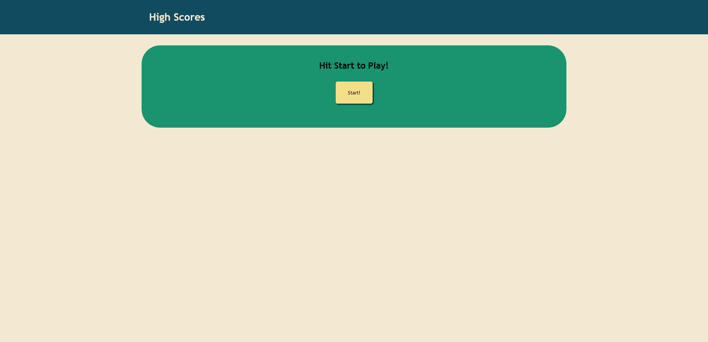
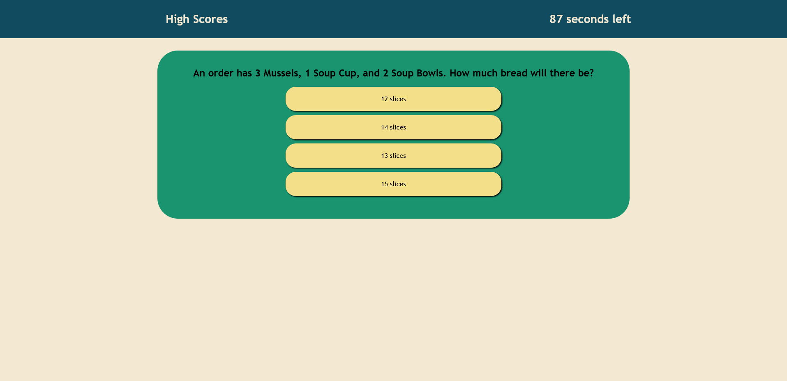
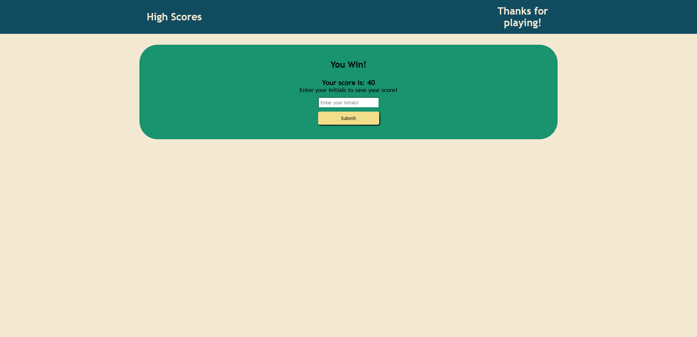
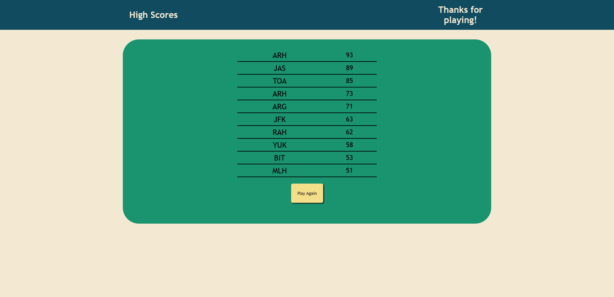

# Quiz Game

## Description
This is an online quiz coded entirely in JavaScript, rendered dynamically on one webpage. I made this quiz about my job, since I couldn't think of anything else at the moment, meaning that there are likely only about a dozen other people in the world who can answer these questions with a decent chance of being correct.

This project was quite taxing, mostly because I was only able to code during times in which I was already very tired, making the idea-generating process much more difficult. However, it was very informative, and I learned quite a lot about JavaScript variables, functions, and event listeners. My favorite part of this project was realizing I could assign classes to the answers the user selects in JavaScript in order to style them in CSS in response to those selections. It did a lot to make the website feel more "modern" and alive.

This website is able to dynamically generate all the questions, store and retrieve an automatically-sorting list of high scores which retain through browser reloads via Local Storage, and update the look of the page based on user input. It also has all the questions and answers stored in easy-to-read and modify arrays. Since it's based off of arrays, and both the length of the questions and the number of options is not capped, this could allow for a much wider variation in question and answer types. Potentially even a drop-down or button to select a specific question set.

## Credits
A lot of credit to MDN, which without I would've been completely lost. A few Stack Overflow posts were able to point me where to look, but I didn't take any code from them.

## Website Link
The live website can be found [here!](https://alecryanhunter.github.io/Quiz-Game/)

## Screenshots
### Start Screen

### During Play

### End Screen

### Score Screen
